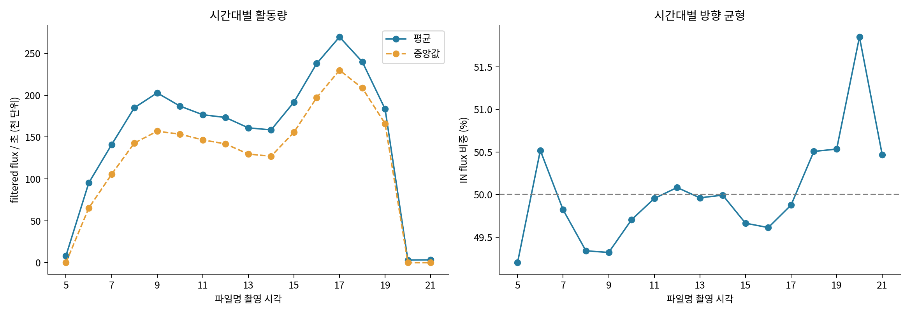
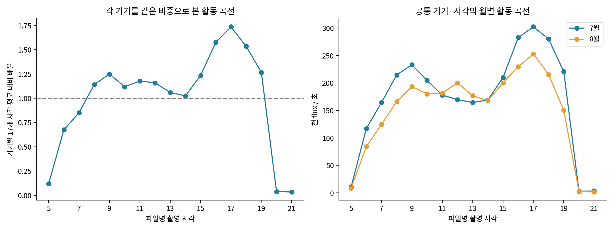
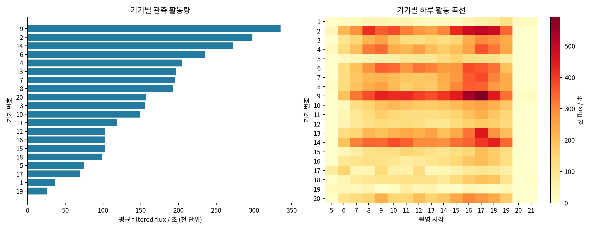
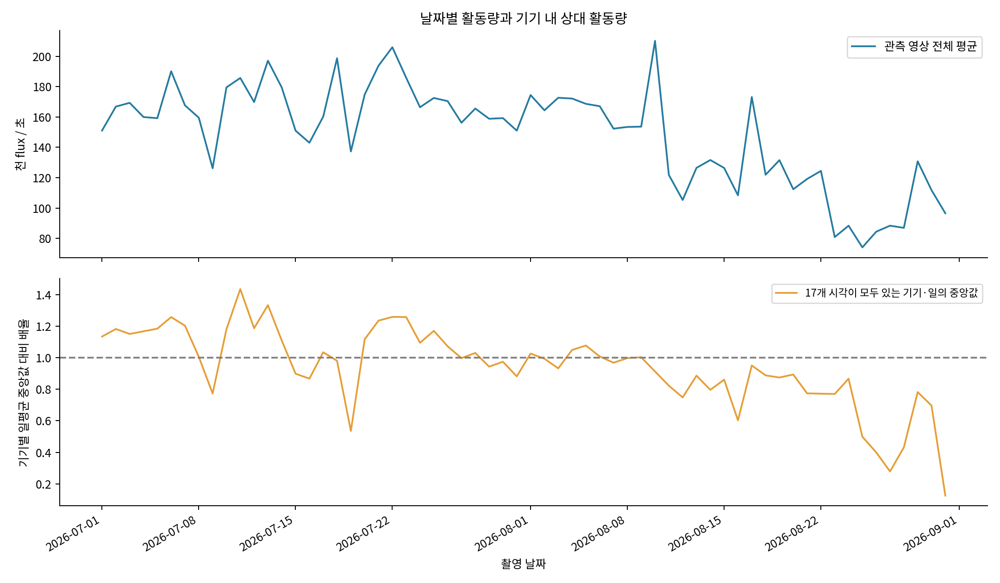
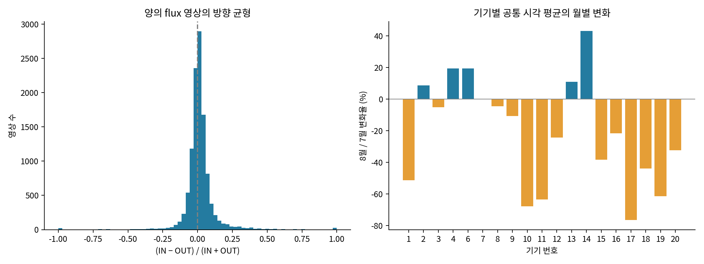
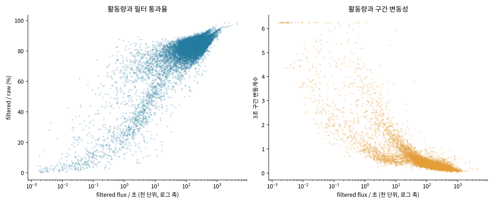
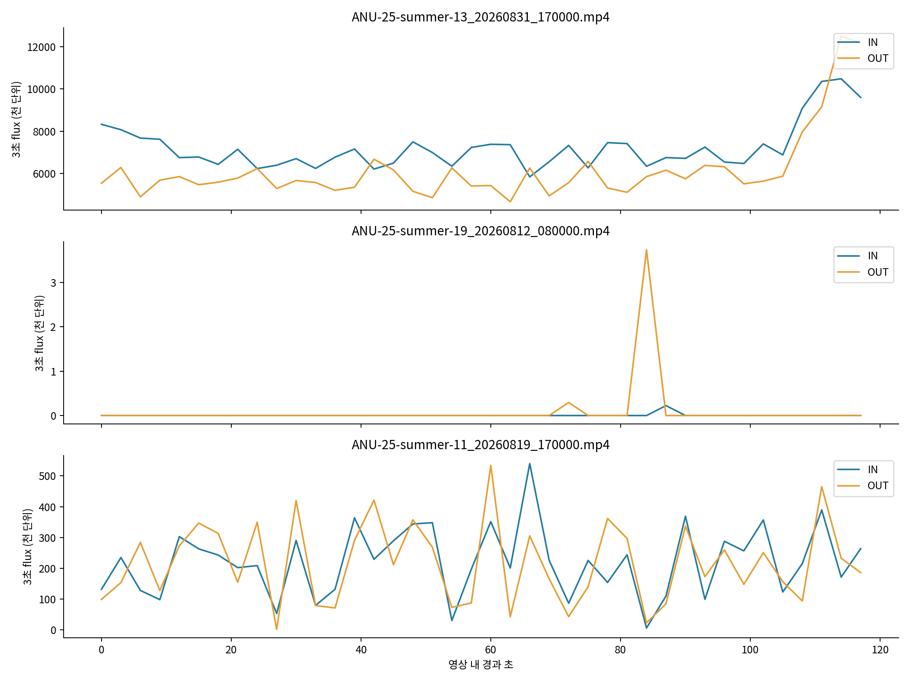

# 2026년 7–8월 벌통 입구 Optical Flow 결과 분석 보고서

작성일: 2026-10-05  
분석 대상: `bee_count_output/yaml_jul_aug_all`  
분석 전제: 해당 디렉토리의 모든 결과는 동일한 연산 설정으로 생성된 비교 가능한 자료로 취급한다.

## 1. 주요 결과

이번 자료의 대표적인 패턴은 **오후 17시의 활동 정점, 높은 IN/OUT 균형, 고활동 영상의 지속적인 flux, 기기별로 다른 월별 변화**이다.

- 영상 **13,688개**, 기기 **20개**, **62일**을 전수 분석했다. 프레임 쌍은 **39,407,752개**, 3초 구간은 **547,520개**이다.
- filtered traffic flux의 총합은 **2.529023e+11**이며, raw flux의 **84.74%**가 남았다. 영상별 평균 활동량은 **154,021.8 flux/초**, 중앙값은 **110,443.4 flux/초**이다.
- 전체 시간대 평균은 **17시 269,538.8 flux/초**로 가장 높다. 오전의 국소 정점은 **9시**이고, 13–14시의 완만한 하락 후 16–18시에 다시 커지는 형태다.
- 전체 IN 비중은 **49.90%**, OUT 비중은 **50.10%**이다. 영상별 IN/OUT flux의 Pearson 상관은 **0.9901**이다.
- 같은 기기·같은 시각을 같은 비중으로 비교한 8월 평균은 7월보다 **13.4% 낮다**. 공통 기기 19개 중 6개는 증가했고 13개는 감소했다.
- 양의 flux가 있는 영상에서 활동량과 3초 구간 변동계수의 Spearman 상관은 **-0.874**이다. 활동량이 클수록 영상 안에서 flux가 지속되는 경향이 강하다.

## 2. 분석 자료와 지표

### 2.1 분석 범위

파일명의 날짜와 시각을 이용하여 **2026-07-01부터 2026-08-31까지, 05–21시**의 결과를 기기·날짜·시각별로 묶었다. 모든 영상은 프레임 쌍 2,879개, 처리 길이 119.9583초, 3초 구간 40개로 구성된다. 프레임 시각의 간격은 1/24초이다. 처리 영상의 길이를 합하면 **456.11시간**이다.

`batch_summary.csv`, 13,688개의 `*_window_3sec.csv`, 13,688개의 `*_frame_flux.csv`를 모두 읽었다. 영상 요약값을 3초 구간 합계 및 프레임 합계와 대조해 집계 일치를 확인했다. 아래 총합은 **저장된 약 2분 영상들의 관측 flux 합계**이며, 촬영 시각 사이를 적분한 하루 전체 활동량과는 집계 단위가 다르다.

### 2.2 지표 정의

| 지표 | 계산 | 의미 |
| --- | --- | --- |
| raw IN/OUT flux | 강도 기준을 통과한 후보 픽셀의 양/음의 경계 법선 flow 합 | persistence와 면적 필터 적용 전 방향별 신호 |
| filtered IN/OUT flux | 필터를 통과한 후보 픽셀의 방향별 flow 합 | 이번 보고서의 중심 지표 |
| traffic flux | IN + OUT | 양방향 경계 활동량 |
| 활동량, rate | 영상의 filtered traffic flux / 처리 초 | 시간당 비교의 기본이 되는 초당 누적 신호 |
| 필터 통과율 | filtered traffic / raw traffic | 후보 신호 중 최종 출력에 남은 비중 |
| IN 비중 | IN / (IN + OUT) | 전체 신호에서 IN 방향이 차지하는 비중 |
| 방향 균형 B | (IN − OUT) / (IN + OUT) | 양수는 IN 우세, 음수는 OUT 우세 |
| 3초 구간 변동계수 CV | 40개 구간의 모집단 표준편차 / 평균 | 영상 안에서의 상대적인 시간 변동성 |
| 상위 4구간 집중도 | 가장 큰 4개 구간 flux / 영상 전체 flux | 약 12초에 모인 신호의 비중 |

분모가 0인 비율과 변동계수는 정의되는 자료만으로 요약했다. 총합 비율은 합계끼리 나눈 flux 가중 비율이고, 영상별 비율의 중앙값은 각 영상을 같은 비중으로 취급한 통계이다. 상위 4구간은 크기순으로 선택하며, 서로 이어진 구간일 필요는 없다.

코드의 `count_est`는 **방향별 flux / 100**으로 저장된다. 이번 보고서에서는 이 값을 flux와 동일한 신호의 환산 지표로 해석하고, 활동량 수치는 원래 flux 단위로 제시한다.

## 3. 기존 시스템 자료와의 연결

### 3.1 연산 방식

기존 [README](README.md), [시스템 설명](docs/presentation.md), [persistence 문서](docs/bee_entrance_persistence_filter.md)와 핵심 구현 [bee_entrance_count.py](src/bee_entrance_count.py)에 따르면, 시스템은 ROI의 연속 영상에서 Farneback optical flow를 계산하고 입구 사각형의 네 경계 방향으로 flow를 투영한다.

각 후보 픽셀에서 `normal_flow = dx × normal_x + dy × normal_y`를 계산한다. 양의 성분을 IN, 음의 성분의 절댓값을 OUT으로 합산한다. Raw는 이미 boundary band와 flow 강도 조건을 통과한 신호이다. Persistence는 프레임 사이에 이어지는 후보를 남기며, 면적 필터는 그 뒤의 연결 성분을 정리한다. 최종 결과는 프레임별 신호와 3초 누적으로 저장된다.

저장된 완료 기록에 기재된 연산값은 boundary band 8픽셀, magnitude 기준 1.0, normal-flow 기준 0.5, blur 5, persistence decay 0.65·threshold 1.3, 최소 component 면적 200픽셀이다. Farneback은 levels 4, winsize 21, iterations 3을 사용한다. 동일한 설정이라는 사용자 전제를 전체 분석에 적용했다.

이 과정에서 flux는 **경계 방향 움직임의 공간·시간 누적량**을 나타낸다. 이번 보고서의 방향성은 이 법선 투영의 IN/OUT 정의를 따른다.

### 3.2 기존 회귀 결과

프로젝트에는 초기 서술 보고서, legacy 통계 CSV, 현재 validation 출력에 서로 다른 표본 규모의 회귀 결과가 남아 있다. 각각의 자료에 기록된 수치를 정리하면 다음과 같다. 아래 MAE/RMSE의 단위는 기존 검증 자료의 count이다.

| 기존 자료 | 방향 | 관측 수 | R | R² | MAE | RMSE |
| --- | --- | --- | --- | --- | --- | --- |
| 기존 서술 보고서 | IN | 500 | 0.9178 | 0.8423 | 12.00 | 20.18 |
| 기존 서술 보고서 | OUT | 500 | 0.9033 | 0.8159 | 11.68 | 18.67 |
| legacy 통계 CSV | IN | 976 | 0.9014 | 0.8124 | 12.44 | 25.00 |
| legacy 통계 CSV | OUT | 976 | 0.8984 | 0.8071 | 13.04 | 26.34 |
| 현재 validation/output 선형 모델 | IN | 3,822 | 0.8791 | 0.7728 | 13.18 | 22.13 |
| 현재 validation/output 선형 모델 | OUT | 3,822 | 0.8650 | 0.7483 | 14.06 | 23.37 |

자료: [초기 선형 회귀 보고서](validation/legacy/linear_regression_report.md), [legacy 회귀 통계](validation/legacy/linear_regression_stats.csv), [현재 회귀 비교 결과](validation/output/regression_model_comparison.csv).

현재 validation 출력의 선형식은 IN에서 `8.666068712e-6 × filtered_in_flux + 6.960286266`, OUT에서 `8.384146128e-6 × filtered_out_flux + 7.171417991`이다. 같은 자료의 flat-exponential 모델은 IN R² 0.7727, OUT R² 0.7481로, 선형 모델과 매우 가까운 적합 결과를 보였다.

기존 자료는 filtered flux가 출입 활동량과 함께 증가한다는 해석을 뒷받침한다. 이번 7–8월 분석은 그 맥락을 이용해 flux의 상대적인 크기와 시간 구조를 해석하며, 별도의 count 회귀를 수행하지 않았다.

### 3.3 기존 feature 보고서의 해석

[2026-06-08 feature 분석 보고서](analysis/video_features/final/analysis_report.md)는 과거 검증 자료에서 frame difference, flow 크기, 방향 균형 등이 count 예측 오차와 연결됨을 보고했다. 낮은 flow에서의 과소예측 사례는 IN 279개, OUT 267개였고, `frame_diff_mean_p90`과 IN 과소예측 오차의 Pearson 상관은 0.758이었다. 방향 균형과 방향 분산도 관련 feature로 제시되었다.

이 기존 결과는 신호의 **총량뿐 아니라 시간 변화와 방향 구조도 함께 읽는 이유**를 제공한다. 본 보고서에서는 현재 디렉토리에 저장된 flux와 후보 픽셀·component 통계만을 이용하여 그 두 측면을 분석했다.


## 4. 전체 활동량의 분포

전체 raw flux는 **2.984611e+11**, filtered flux는 **2.529023e+11**이다. Filtered IN은 **1.262050e+11**, OUT은 **1.266973e+11**로 집계되었다.

| 영상별 활동량 통계 | filtered traffic flux / 초 |
| --- | --- |
| P25 | 4,494.9 |
| P50 / 중앙값 | 110,443.4 |
| P75 | 235,060.2 |
| P90 | 371,536.3 |
| P95 | 471,544.8 |
| P99 | 747,029.1 |
| 최댓값 | 4,452,210.6 |

평균 154,021.8은 중앙값 110,443.4보다 높다. 상위 10% 영상이 전체 filtered flux의 **35.0%**, 상위 1%가 **6.9%**를 차지한다. 이는 다수의 중간 활동 영상과 일부 큰 활동 영상이 함께 있는 오른쪽 꼬리 분포를 나타낸다. 상위 비중 계산에는 각각 활동량 상위 1,369개와 137개 영상을 사용했다.

Filtered flux가 0인 영상은 **2,355개(17.2%)**이다. 이 가운데 raw도 0인 영상은 2,015개이고, raw는 있으나 최종 필터 후 0이 된 영상은 340개이다. 양의 filtered flux를 갖는 **11,333개** 영상의 활동량 중앙값은 **146,193.3 flux/초**이다.

따라서 전체 중앙값, 양의 flux 영상의 중앙값, 큰 활동 구간의 상위 분위수는 서로 다른 활동 상태를 요약한다. 이후 해석에서는 0 구간이 많은 시간대와 지속적인 양의 flux 시간대를 함께 표시한다.

## 5. 시간대별 활동 곡선

| 촬영 시각 | 영상 수 | 평균: 천 flux/초 | 중앙값: 천 flux/초 | 0 영상 비중 | 통과율 | IN 비중 |
| --- | --- | --- | --- | --- | --- | --- |
| 05시 | 818 | 8.2 | 0.0 | 84.5% | 79.2% | 49.20% |
| 06시 | 800 | 95.2 | 65.2 | 10.4% | 82.0% | 50.52% |
| 07시 | 792 | 140.8 | 105.4 | 1.4% | 84.1% | 49.82% |
| 08시 | 777 | 185.0 | 142.9 | 1.0% | 85.2% | 49.34% |
| 09시 | 784 | 202.8 | 157.0 | 0.5% | 85.0% | 49.32% |
| 10시 | 787 | 187.0 | 153.5 | 0.5% | 84.3% | 49.70% |
| 11시 | 798 | 176.7 | 146.7 | 0.6% | 83.8% | 49.95% |
| 12시 | 817 | 173.4 | 141.8 | 0.4% | 84.0% | 50.08% |
| 13시 | 814 | 161.0 | 129.7 | 0.7% | 84.1% | 49.96% |
| 14시 | 805 | 158.6 | 127.1 | 3.1% | 84.2% | 49.99% |
| 15시 | 815 | 191.7 | 155.7 | 1.5% | 84.9% | 49.66% |
| 16시 | 818 | 237.8 | 197.2 | 0.5% | 86.1% | 49.61% |
| 17시 | 825 | 269.5 | 229.8 | 0.7% | 86.8% | 49.88% |
| 18시 | 814 | 239.9 | 208.5 | 1.0% | 85.7% | 50.51% |
| 19시 | 812 | 183.5 | 166.0 | 2.1% | 83.5% | 50.53% |
| 20시 | 806 | 3.2 | 0.0 | 82.9% | 66.9% | 51.85% |
| 21시 | 806 | 3.3 | 0.0 | 99.3% | 80.0% | 50.46% |



그림 1. 전체 관측의 시간대별 활동량과 flux 가중 IN 비중.

시간대별 곡선은 6시부터 빠르게 상승해 오전 9시에 국소 정점을 만들고, 13–14시에 완만하게 낮아진 뒤 17시에 가장 높은 값을 보인다. **17시 평균은 9시의 1.33배, 14시의 1.70배**이다. 16–18시의 세 시각에 전체 관측 flux의 **29.0%**가 모이며, 7–19시에는 **95.8%**가 모인다.

5시, 20시, 21시는 중앙값이 모두 0이다. 특히 21시는 806개 중 800개가 0이고, 나머지 6개만 양의 flux를 갖는다. 이 6개 안의 높은 신호 때문에 21시 평균이 20시 평균보다 조금 높게 나타난다. 21시의 대표적인 상태는 중앙값 0과 99.3%의 0 비중으로 설명된다.

각 기기의 17개 시각 평균을 같은 비중으로 평균한 값을 기준으로 시간대 곡선을 나눈 뒤, 20개 기기를 같은 비중으로 평균해도 17시가 가장 높다. 이 값은 기기별 기준 활동량의 **1.74배**이며, 20개 중 **12개**의 평균 곡선 정점이 17시에 있다. 정점이 16–18시에 있는 기기는 **16개**이다. 오후 정점은 여러 기기에서 반복되는 구조로 해석할 수 있다.



그림 2. 기기를 같은 비중으로 본 상대 시간대 곡선과 공통 기기·시각의 7월/8월 곡선.

가능한 해석은 **입구 경계 활동이 오전 상승과 오후 강화라는 일중 리듬을 갖는다**는 것이다. 낮 전체가 같은 수준으로 유지되기보다 시각에 따라 활동의 크기가 달라지며, 방향 비중은 대체로 50% 가까이 유지된다.

## 6. 기기별 활동 수준과 특징

아래 활동량은 각 기기의 저장된 모든 시각을 포함한 평균이다. 정점 시각은 기기별 시간대 평균이 가장 큰 시각으로 정의했다.

| 기기 | 영상 수 | 관측 날짜 수 | 평균: 천 flux/초 | 중앙값: 천 flux/초 | 평균 곡선 정점 | 0 비중 | 통과율 |
| --- | --- | --- | --- | --- | --- | --- | --- |
| 1 | 1,029 | 62 | 36.2 | 14.9 | 19시 | 16.6% | 83.2% |
| 2 | 677 | 42 | 298.1 | 286.7 | 17시 | 14.0% | 86.0% |
| 3 | 810 | 48 | 155.3 | 137.7 | 17시 | 17.0% | 81.0% |
| 4 | 749 | 47 | 204.9 | 207.5 | 17시 | 15.4% | 83.0% |
| 5 | 106 | 7 | 74.8 | 69.6 | 15시 | 17.0% | 82.5% |
| 6 | 753 | 48 | 235.3 | 218.6 | 16시 | 15.5% | 84.9% |
| 7 | 312 | 21 | 195.5 | 195.6 | 17시 | 11.9% | 88.0% |
| 8 | 457 | 29 | 193.1 | 186.3 | 16시 | 12.0% | 84.4% |
| 9 | 802 | 48 | 335.2 | 361.9 | 17시 | 18.3% | 87.6% |
| 10 | 485 | 30 | 148.5 | 114.5 | 17시 | 19.0% | 86.4% |
| 11 | 912 | 55 | 118.6 | 100.0 | 17시 | 20.4% | 87.2% |
| 12 | 984 | 59 | 102.7 | 92.9 | 17시 | 16.8% | 85.2% |
| 13 | 356 | 23 | 196.7 | 157.8 | 17시 | 13.5% | 84.9% |
| 14 | 969 | 59 | 272.4 | 242.0 | 18시 | 16.9% | 82.2% |
| 15 | 1,045 | 62 | 102.3 | 97.0 | 17시 | 18.0% | 83.9% |
| 16 | 818 | 49 | 102.7 | 96.4 | 17시 | 15.0% | 84.4% |
| 17 | 488 | 35 | 69.8 | 10.9 | 06시 | 16.8% | 81.7% |
| 18 | 1,029 | 61 | 98.6 | 90.3 | 17시 | 20.6% | 86.5% |
| 19 | 742 | 48 | 26.0 | 1.4 | 11시 | 23.5% | 77.9% |
| 20 | 165 | 12 | 156.4 | 170.8 | 16시 | 17.0% | 87.5% |



그림 3. 기기별 평균 활동량과 기기·시각별 활동량 지도.

평균 활동량 상위 기기는 **9번 335.2천, 2번 298.1천, 14번 272.4천, 6번 235.3천 flux/초**이다. 9번과 2번은 중앙값도 각각 361.9천, 286.7천으로 높다. 높은 평균과 높은 중앙값이 함께 나타나므로 두 기기는 많은 관측에서 큰 flux가 지속되는 유형으로 볼 수 있다.

1번과 19번의 평균은 각각 36.2천, 26.0천 flux/초이다. 19번 중앙값은 1.4천으로 평균과 차이가 크다. 17번도 평균 69.8천에 비해 중앙값은 10.9천이다. 이들 결과는 **대표적인 낮은 신호 상태와 일부 큰 신호 상태가 섞인 활동 분포**를 보여준다.

기기별 통과율은 19번 77.9%부터 7번 88.0%까지 분포한다. 높은 활동 수준의 기기와 낮은 활동 수준의 기기는 남는 신호의 비중도 서로 다르다. 기기의 특징을 표현할 때 평균 활동량, 중앙값, 0 비중, 통과율을 함께 읽으면 지속적인 활동과 간헐적인 활동을 구분하기 쉽다.

## 7. 7월과 8월의 변화

### 7.1 월별 관측 요약

| 월 | 영상 수 | 평균: 천 flux/초 | 중앙값: 천 flux/초 | 0 비중 | 통과율 | IN 비중 |
| --- | --- | --- | --- | --- | --- | --- |
| 7월 | 7,726 | 168.8 | 137.7 | 15.8% | 85.4% | 49.81% |
| 8월 | 5,962 | 134.9 | 77.7 | 19.0% | 83.7% | 50.05% |

전체 관측의 평균 활동량은 7월 168.8천에서 8월 134.9천 flux/초로 **20.1% 감소**했다. 중앙값은 137.7천에서 77.7천으로 낮아졌고, 0 영상 비중은 15.8%에서 19.0%로 높아졌다. 전체 관측으로 보면 8월은 낮은 신호 상태의 비중이 더 크다.

### 7.2 같은 기기·시각의 비교

7월과 8월 모두 자료가 있는 **19개 기기 × 17개 시각 = 323개 조합**에서 각 월의 평균 활동량을 구했다. 각 조합에 동일한 가중치를 부여하면 7월은 **172.2천**, 8월은 **149.2천 flux/초**이고 변화율은 **-13.4%**이다. 기기별 표도 공통 17개 시각을 같은 비중으로 평균했다. 5번은 8월 자료만 있으므로 월별 짝 비교에는 들어가지 않는다.

| 기기 | 7월: 천 flux/초 | 8월: 천 flux/초 | 변화율 |
| --- | --- | --- | --- |
| 1 | 48.5 | 23.6 | -51.3% |
| 2 | 291.5 | 317.0 | +8.8% |
| 3 | 158.4 | 150.3 | -5.1% |
| 4 | 190.6 | 227.4 | +19.3% |
| 6 | 220.9 | 263.6 | +19.4% |
| 7 | 192.3 | 192.9 | +0.3% |
| 8 | 195.8 | 186.8 | -4.6% |
| 9 | 349.6 | 312.1 | -10.7% |
| 10 | 222.4 | 71.7 | -67.8% |
| 11 | 164.5 | 60.1 | -63.5% |
| 12 | 115.8 | 87.7 | -24.3% |
| 13 | 180.4 | 200.2 | +11.0% |
| 14 | 227.0 | 324.8 | +43.1% |
| 15 | 126.5 | 78.1 | -38.3% |
| 16 | 113.1 | 88.6 | -21.7% |
| 17 | 108.6 | 25.5 | -76.5% |
| 18 | 125.7 | 70.5 | -43.9% |
| 19 | 33.7 | 13.0 | -61.5% |
| 20 | 207.3 | 140.1 | -32.4% |

증가 폭이 큰 기기는 **14번 +43.1%, 6번 +19.4%, 4번 +19.3%**이다. 13번과 2번도 증가했고, 7번은 +0.3%로 거의 같은 수준이다. 감소 폭이 큰 기기는 **17번 −76.5%, 10번 −67.8%, 11번 −63.5%, 19번 −61.5%**이다.

가능한 해석은 **8월의 전체적인 활동 감소와 기기별 증가가 동시에 존재한다**는 것이다. 월별 변화는 여러 입구에서 같은 크기로 나타나는 변화가 아니며, 기기별 경계 활동의 변화 폭과 방향이 다르다. 두 달의 공통 시각 곡선에서는 오후 정점이 계속 나타난다.

공통 기기·시각의 곡선을 시각별로 비교하면 8월의 **12시는 18.0% 증가**, **13시는 7.5% 증가**한다. 17시는 **16.3% 감소**한다. 전체 평균이 낮아진 가운데 정오 부근의 신호는 커졌으므로, 월별 변화에는 활동 규모의 감소와 하루 안의 활동 분포 변화가 함께 들어 있다.


## 8. 날짜별 활동 변화

각 기기에서 05–21시의 17개 시각이 모두 있는 기기·일 **701개**를 골라 일평균 활동량을 계산했다. 이를 해당 기기의 완전한 기기·일 활동량 중앙값으로 나누어 상대 활동량을 구하고, 같은 날짜의 기기들에서 중앙값을 취했다. 값 1은 각 기기의 관측 기간 중 대표적인 일평균 활동 수준을 뜻한다.

아래 표는 이 집계에서 10개 이상의 기기가 참여한 날짜 가운데 상대 활동량 상위/하위 각 4일이다.

| 날짜 | 참여 기기 수 | 상대 활동량 중앙값 | 구분 |
| --- | --- | --- | --- |
| 2026-07-11 | 17 | 1.435 | 상위 |
| 2026-07-13 | 16 | 1.333 | 상위 |
| 2026-07-22 | 14 | 1.258 | 상위 |
| 2026-07-23 | 11 | 1.257 | 상위 |
| 2026-08-16 | 13 | 0.603 | 하위 |
| 2026-08-12 | 19 | 0.748 | 하위 |
| 2026-08-21 | 10 | 0.774 | 하위 |
| 2026-08-14 | 15 | 0.796 | 하위 |



그림 4. 날짜별 전체 관측 평균과 완전한 기기·일의 상대 활동량 중앙값.

7월 11일은 17개 기기의 상대 활동량 중앙값이 **1.435**로 대표 수준보다 약 43.5% 높고, 8월 16일은 13개 기기에서 **0.603**으로 약 39.7% 낮다. 여러 기기에서 활동 수준이 함께 높거나 낮은 날짜가 관측된다.

완전한 기기·일의 일평균 활동량을 공통 날짜 10일 이상인 기기 쌍에서 비교하면, 141개 쌍의 Pearson 상관 중앙값은 **0.171**이다. 이 값과 기기별 월별 변화 결과를 함께 보면, 날짜에 따른 공통 활동 변화와 기기 고유의 변화가 함께 나타나는 것으로 해석할 수 있다. 여기서 날짜별 해석은 계산된 flux의 시간적 패턴에 근거한다.

## 9. IN/OUT 균형과 방향성

전체 flux에서 IN 비중은 **49.90%**, OUT 비중은 **50.10%**이다. 전체 방향 균형은 **-0.00195**로 매우 작다. 영상별 IN과 OUT 총량은 Pearson **0.9901**, Spearman **0.9974**의 높은 상관을 보인다.

양의 flux 영상 가운데 **86.6%**는 `|B| < 0.1`, 즉 IN 비중이 45–55% 범위에 있다. `|B|` 중앙값은 **0.0314**이고 P90은 **0.1234**이다. IN 우세 영상은 **6,619개**, OUT 우세 영상은 **4,714개**이다. 방향 우세 영상의 개수와 전체 누적 flux는 각각 영상 단위와 신호 크기 단위의 요약이다.

3초 구간 전체에서 IN과 OUT이 동시에 양수인 구간은 **419,269개(76.6%)**이며, 양의 traffic flux 구간만 놓으면 **98.1%**이다. 프레임에서는 전체의 **56.8%**가 양방향 양의 flux를 함께 가진다.

이 결과는 **높은 활동량에서 두 방향 신호가 함께 커지는 양방향 경계 활동**으로 해석할 수 있다. 기기 전체의 IN 비중도 6번 48.55%에서 18번 51.30% 범위로 좁다. 시간대별로 18–19시는 약한 IN 우세가 나타나지만, 큰 방향 이동보다는 traffic 크기의 변화가 자료의 주요 변동을 설명한다.

양의 flux 영상에서 활동량과 `|B|`의 Spearman 상관은 **-0.425**이다. 낮은 활동량에서는 한 방향 성분이 상대적으로 크게 보이는 구간이 더 많고, 높은 활동량에서는 방향 비율이 50% 부근에 모이는 경향이 있다.



그림 5. 영상별 방향 균형의 분포와 기기별 공통 시각 평균의 월별 변화.

## 10. 필터링 결과의 수치적 특성

### 10.1 남는 flux와 후보 픽셀

전체 raw 대비 filtered flux 통과율은 **84.74%**, 제거 비중은 **15.26%**이다. IN 통과율은 **84.44%**, OUT 통과율은 **85.03%**로 비슷하다.

프레임 CSV의 후보 픽셀 수를 전부 더하면 다음과 같다. 아래 수는 같은 위치라도 프레임마다 다시 누적한 **픽셀·프레임 수**이다.

| 단계 | 누적 후보 픽셀·프레임 | 직전 단계 대비 통과율 | raw 대비 통과율 |
| --- | --- | --- | --- |
| raw 후보 픽셀 | 153,743,705,436 | 100.0% | 100.0% |
| persistence 후 후보 픽셀 | 129,514,480,060 | 84.2% | 84.2% |
| 면적 필터 후 후보 픽셀 | 116,871,191,205 | 90.2% | 76.0% |

Persistence 단계에서 raw 후보 픽셀의 약 **15.8%**가 제거되고, 면적 필터에서 그 뒤 남은 후보의 약 **9.8%**가 추가로 제거된다. 최종 후보 픽셀은 raw의 **76.0%**이다.

면적 필터 입력 component는 **458,013,686개**, 통과 component는 **175,193,142개**, 제거 component는 **282,820,544개**이다. Component 수의 통과율은 **38.25%**이며, 이 component는 persistence 뒤 면적 필터에 입력된 연결 성분을 뜻한다.

결과적으로 **component 수는 61.7%, 후보 픽셀 수는 24.0%, flux는 15.3% 줄었다**. 남은 후보 픽셀의 평균 법선 flow 절댓값은 raw **1.941**에서 filtered **2.164**로 커진다. 이는 제거된 성분이 평균적으로 더 작거나 약한 flow를 가진다는 해석과 맞는다. 통과한 component와 픽셀에는 더 큰 움직임 성분이 집중되어 있다.

### 10.2 활동 수준별 필터 통과율

영상별 활동량으로 전체 영상을 동일한 개수의 네 그룹으로 나누었다. Q1은 낮은 활동부터, Q4는 높은 활동까지이며 각 그룹은 3,422개이다. CV와 상위 4구간 집중도는 양의 flux 영상에서 정의된다.

| 활동 그룹 | 영상 수 | 중앙값: 천 flux/초 | 그룹 합계 통과율 | CV 평균 | 상위 4구간 집중도 중앙값 |
| --- | --- | --- | --- | --- | --- |
| Q1 | 3,422 | 0.0 | 35.2% | 2.319 | 59.9% |
| Q2 | 3,422 | 56.6 | 78.2% | 0.635 | 20.0% |
| Q3 | 3,422 | 164.5 | 83.1% | 0.317 | 15.7% |
| Q4 | 3,422 | 340.9 | 86.6% | 0.224 | 13.8% |

Q1의 통과율은 **35.2%**, Q4는 **86.6%**이다. 양의 flux 영상의 활동량과 통과율 간 Spearman 상관은 **0.708**이다. 낮은 활동 그룹에서는 짧고 작은 후보가 차지하는 비중이 크고, 높은 활동 그룹에서는 필터 조건을 통과하는 지속적 신호가 더 큰 비중을 차지하는 것으로 해석할 수 있다.



그림 6. 양의 flux 영상의 활동량과 필터 통과율, 3초 구간 변동계수.

## 11. 3초 구간의 변동성과 큰 활동 사례

### 11.1 지속성과 간헐성

3초 구간에서 flux가 0인 구간은 **120,091개(21.9%)**이다. 양의 flux 영상의 CV 중앙값은 **0.333**, P90은 **1.083**이다. 상위 4구간 집중도 중앙값은 **16.2%**로, 대표적인 영상에서는 약 10%의 시간에 16.2%의 flux가 모인다.

가장 큰 4개 구간에 전체 flux의 절반을 넘게 모은 영상은 **729개**, 양의 flux 영상의 **6.4%**이다. 최대 구간이 구간 평균의 5배를 넘는 영상은 **1,017개(9.0%)**이다. 이러한 영상은 한 영상 안에서도 신호가 간헐적으로 발생하는 유형이다.

활동량과 CV의 Spearman 상관 **−0.874** 및 활동 그룹별 결과는 고활동 영상의 신호가 상대적으로 균일하고 지속적임을 보여준다. Q4 CV 평균은 0.224, 상위 4구간 집중도 중앙값은 13.8%이며, Q1에서는 각각 2.319와 59.9%이다.

프레임별 양의 flux 비중은 전체에서 **68.8%**이다. 연속 프레임 flux의 lag-1 상관은 영상별 중앙값 **0.681**, 연속 3초 구간에서는 **0.367**이다. 프레임 단계의 persistence가 포함된 최종 출력은 가까운 시간끼리 이어지는 구조를 가지며, 3초 누적에서도 그 연속성이 일부 유지된다.

### 11.2 활동량 상위 영상

| 영상 식별자 | 천 flux/초 | 통과율 | IN 비중 | CV | 상위 4구간 비중 |
| --- | --- | --- | --- | --- | --- |
| ANU-25-summer-13_20260831_170000 | 4,452.2 | 97.7% | 53.99% | 0.187 | 15.2% |
| ANU-25-summer-14_20260719_070000 | 4,201.6 | 98.6% | 49.81% | 0.142 | 12.3% |
| ANU-25-summer-17_20260706_060000 | 2,982.6 | 96.9% | 50.85% | 0.148 | 12.3% |
| ANU-25-summer-17_20260816_120000 | 2,428.1 | 98.7% | 67.08% | 0.501 | 13.9% |
| ANU-25-summer-17_20260703_090000 | 2,366.4 | 96.4% | 49.54% | 0.410 | 17.1% |
| ANU-25-summer-1_20260718_190000 | 2,358.8 | 96.3% | 49.00% | 0.203 | 13.5% |
| ANU-25-summer-2_20260803_170000 | 2,075.5 | 95.9% | 41.44% | 0.100 | 12.0% |
| ANU-25-summer-2_20260713_180000 | 1,872.6 | 95.6% | 47.96% | 0.085 | 11.7% |

가장 큰 영상은 **13번 기기의 8월 31일 17시**이며, 활동량은 **4,452.2천 flux/초**이다. 이 영상의 CV는 0.187, 상위 4구간 비중은 15.2%로 영상 전체에서 큰 신호가 이어진다. 다음으로 큰 **14번 기기의 7월 19일 07시**도 CV 0.142, 상위 4구간 비중 12.3%로 지속적인 고활동 사례이다.

전체 최대 3초 구간은 13번 기기의 위 영상 **114–117초**에서 나타났으며, filtered traffic flux는 **22,995,724.5**, IN은 **10,484,030.9**, OUT은 **12,511,693.6**이다. 양방향 신호가 모두 크다.

큰 활동 영상에서도 개별 방향 편향은 나타난다. **17번 기기의 8월 16일 12시**는 IN 비중 **67.1%**, **2번 기기의 8월 3일 17시**는 OUT 비중 **58.6%**이다. 전체적으로 균형 잡힌 flux와 특정 영상에서의 방향성 있는 움직임이 함께 관측되는 사례이다.

상위 영상 대부분에서 통과율이 95% 이상이고 CV가 비교적 작다는 점은, 큰 flux가 작은 시간 구간의 단발성 성분만으로 구성되지 않고 많은 구간에서 유지된다는 해석을 뒷받침한다.



그림 7. 최대 활동 영상, 상위 4구간 집중도가 100%인 간헐 영상, 양의 활동량 중앙값 근처 영상의 IN/OUT 시계열. 패널별 세로축 범위는 각 신호 크기를 따른다.

## 12. 종합 해석

이번 결과에서 optical flow가 보여주는 활동의 핵심은 다음 다섯 가지이다.

1. **하루 안의 반복적인 활동 리듬:** 오전 상승 뒤 오후 16–18시에 강해지며 17시가 대표 정점이다. 기기별 상대 곡선에서도 같은 구조가 나타난다.
2. **전체량이 함께 커지는 양방향 움직임:** IN과 OUT이 매우 높은 상관을 보이고, 대부분의 양의 flux 영상에서는 방향 비중이 50% 부근이다. 활동량 변화의 중심은 traffic 규모이다.
3. **지속적인 고활동과 간헐적인 저활동:** 활동량이 높은 영상은 낮은 상대 변동성과 높은 필터 통과율을 가진다. 낮은 활동에서는 작은 수의 3초 구간에 신호가 집중되는 경우가 많다.
4. **월별 감소와 기기별 차이의 공존:** 공통 기기·시각의 평균은 8월에 13.4% 감소했지만, 14번·6번·4번 등의 활동은 증가했다. 시간대 리듬과 기기별 장기 변화가 서로 다른 수준의 패턴으로 관측된다.
5. **필터가 남긴 신호의 특성:** 많은 작은 component와 약한 후보 픽셀이 제거되면서도 전체 flux의 84.7%가 유지된다. 필터 후에는 후보 픽셀당 평균 경계 방향 움직임이 더 크다.

기존 검증 보고서가 제시한 **filtered flux와 출입 활동량의 양의 관계**를 바탕으로, 이번 결과는 입구 활동을 **규모·방향·지속성·시간대·기기별 변화**의 다섯 축에서 해석할 수 있다. 이 보고서의 해석은 동일한 설정으로 생성된 optical-flow 출력의 수치와 시간적 구조에 근거한다.

## 부록. 산출물과 재현

원본 결과는 [분석 대상 디렉토리](bee_count_output/yaml_jul_aug_all)에 있다. 새로 만든 분석 자료는 [analysis/jul_aug_optical_flow](analysis/jul_aug_optical_flow)에 저장했다.

| 산출물 | 내용 |
| --- | --- |
| [video_summary.csv](analysis/jul_aug_optical_flow/tables/video_summary.csv) | 13,688개 영상별 활동량·방향 균형·변동성 |
| [frame_video_summary.csv](analysis/jul_aug_optical_flow/tables/frame_video_summary.csv) | 전 프레임 후보 픽셀·component·flux 재집계 |
| [device.csv](analysis/jul_aug_optical_flow/tables/device.csv) / [hour.csv](analysis/jul_aug_optical_flow/tables/hour.csv) | 기기별 / 시각별 요약 |
| [device_month.csv](analysis/jul_aug_optical_flow/tables/device_month.csv) / [month.csv](analysis/jul_aug_optical_flow/tables/month.csv) | 기기·월 / 월별 요약 |
| [matched_device_hour_month.csv](analysis/jul_aug_optical_flow/tables/matched_device_hour_month.csv) | 공통 323개 기기·시각의 월별 평균 |
| [matched_device_month.csv](analysis/jul_aug_optical_flow/tables/matched_device_month.csv) | 공통 시각을 동일 비중으로 평균한 기기별 변화 |
| [normalized_day.csv](analysis/jul_aug_optical_flow/tables/normalized_day.csv) | 완전한 기기·일의 날짜별 상대 활동량 |
| [complete_device_days.csv](analysis/jul_aug_optical_flow/tables/complete_device_days.csv) | 17개 시각이 모두 있는 기기·일 |
| [normalized_hour.csv](analysis/jul_aug_optical_flow/tables/normalized_hour.csv) | 기기 동일 비중 시간 곡선 및 공통 기기의 월별 시간 곡선 |
| [distribution.csv](analysis/jul_aug_optical_flow/tables/distribution.csv) / [activity_quartiles.csv](analysis/jul_aug_optical_flow/tables/activity_quartiles.csv) | 지표 분위수 / 활동량 사분위 그룹 |
| [top_videos.csv](analysis/jul_aug_optical_flow/tables/top_videos.csv) / [top_windows.csv](analysis/jul_aug_optical_flow/tables/top_windows.csv) | 큰 활동 영상 / 큰 3초 구간 |
| [summary.json](analysis/jul_aug_optical_flow/summary.json) | 전체 요약, 상관계수, 합계 대조 결과 |
| [figures](analysis/jul_aug_optical_flow/figures) | 보고서에 사용한 그림 7개 |

재현 명령은 프로젝트 최상단에서 실행한다. 저장된 연산 결과를 집계하며 optical flow를 다시 계산하지 않는다.

```bash
MPLCONFIGDIR=/tmp/bee_flow_mpl .venv/bin/python analysis/jul_aug_optical_flow/analyze.py
MPLCONFIGDIR=/tmp/bee_flow_mpl .venv/bin/python analysis/jul_aug_optical_flow/write_report.py
```

분석 스크립트는 기존 프로젝트의 NumPy·Pandas·Matplotlib를 사용한다. Spearman 상관은 결측 쌍을 제외한 뒤 평균 순위의 Pearson 상관으로 계산한다. 0 신호가 아닌 영상의 CV에는 40개 구간의 모집단 표준편차를 사용한다.
