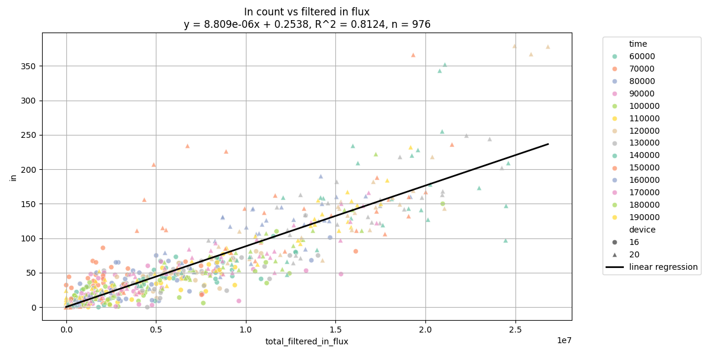
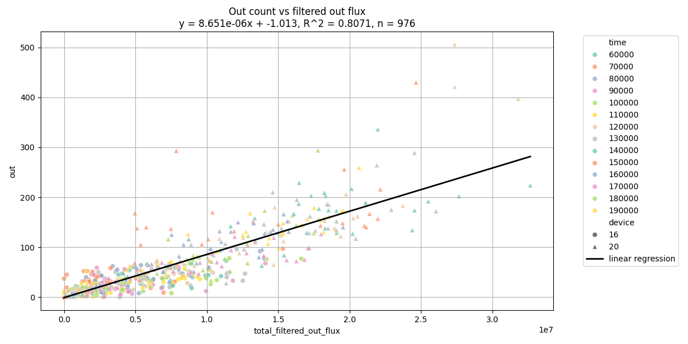

# Optical Flow 기반 벌 출입 수 선형 회귀 분석 보고서

## 1. 분석 목적

본 보고서는 optical flow 기반으로 산출한 filtered flux 값이 실제 벌의 입출입 수를 얼마나 잘 설명하는지 평가하기 위해 작성되었다. 분석에는 다음 두 개의 단순 선형 회귀 모델을 사용하였다.

- `total_filtered_in_flux`를 이용한 `in` count 예측
- `total_filtered_out_flux`를 이용한 `out` count 예측

각 회귀식에는 총 500개의 관측값이 사용되었다. 이는 3~4월 6번 기기의 2분 30초 녹화 영상을 기반으로 추출한 데이터이다.

## 2. 회귀식

### IN count 모델



```text
in = 0.0000116523 * total_filtered_in_flux + 6.1251
```

`total_filtered_in_flux`가 100,000 증가하면 예측되는 `in` count는 약 1.17마리 증가한다.

### OUT count 모델



```text
out = 0.0000162326 * total_filtered_out_flux + 4.9832
```

`total_filtered_out_flux`가 100,000 증가하면 예측되는 `out` count는 약 1.62마리 증가한다.

## 3. 주요 결과

| 모델 | R | R-squared | Adjusted R-squared | MAE | RMSE | p-value |
| --- | ---: | ---: | ---: | ---: | ---: | ---: |
| IN count | 0.9178 | 0.8423 | 0.8420 | 12.00 | 20.18 | 7.04e-202 |
| OUT count | 0.9033 | 0.8159 | 0.8155 | 11.68 | 18.67 | 4.03e-185 |

두 모델 모두 filtered flux와 실제 count 사이에 강한 양의 상관관계를 보였다. p-value가 매우 작고, 두 모델의 기울기 95% 신뢰구간이 모두 0을 포함하지 않으므로 flux와 count 사이의 양의 관계는 통계적으로 유의하다고 볼 수 있다.

## 4. 결과 해석

IN count 모델의 R-squared는 0.8423으로, 실제 `in` count 변동의 약 84.2%를 `total_filtered_in_flux`가 설명한다. 이는 incoming activity를 추정하는 데 filtered in flux가 강한 예측 변수임을 의미한다. 다만 MAE가 약 12.0마리, RMSE가 약 20.2마리이므로 개별 구간의 예측값은 실제 count와 어느 정도 차이가 날 수 있다.

OUT count 모델의 R-squared는 0.8159로, 실제 `out` count 변동의 약 81.6%를 `total_filtered_out_flux`가 설명한다. IN 모델보다 설명력은 약간 낮지만, 여전히 강한 예측력을 보인다. MAE는 약 11.7마리, RMSE는 약 18.7마리로 나타났다.

OUT 모델의 기울기는 IN 모델보다 크다. 이는 같은 크기의 filtered flux가 관측되었을 때 OUT 방향에서는 더 많은 count로 환산된다는 뜻이다. 이러한 차이는 벌의 이동 방향별 움직임 특성, optical flow 검출 민감도, 입구 영역의 기하 구조 차이에서 비롯되었을 수 있다.

## 5. 한계

두 모델 모두 절편이 양수이다.

- IN 절편: 6.13
- OUT 절편: 4.98

이는 flux가 0에 가까운 상황에서도 모델이 일정 수의 벌을 예측한다는 의미이다. 따라서 저활동 구간에서는 실제보다 count를 과대 추정할 가능성이 있다. 이러한 양의 절편은 배경 움직임, optical-flow noise, 또는 flux와 실제 count 사이의 기본 offset에서 발생했을 수 있다.

또한 오차 규모가 작지는 않다. 두 모델의 MAE는 약 12마리 수준이고 RMSE는 약 19에서 20마리 수준이다. 따라서 현재 회귀식은 전체 활동량 추세를 파악하거나 flux를 실제 count scale로 변환하는 보정식으로는 유용하지만, 각 구간의 벌 수를 정밀하게 산출하는 모델로 보기에는 아직 한계가 있다.

## 6. 결론

분석 결과, filtered optical-flow flux는 벌의 입출입 count를 예측하는 데 통계적으로 유의한 변수로 확인되었다. IN 모델은 약 84.2%, OUT 모델은 약 81.6%의 설명력을 보였으며, 두 모델 모두 강한 양의 상관관계를 나타냈다.

따라서 현재 회귀식은 optical flow 기반 flux 값을 실제 벌 count로 환산하기 위한 1차 calibration 모델로 활용할 수 있다. 특히 시간대별 활동량 비교, 전체 출입 경향 분석, 모델 튜닝 결과 평가에 유용하다. 다만 저활동 구간에서의 과대 추정 가능성과 개별 구간 예측 오차를 고려하여 추가 보정이 필요하다.

## 7. 향후 개선 방향

1. 절편을 0으로 고정한 회귀 모델과 현재 모델을 비교한다.
2. 저활동, 중간 활동, 고활동 구간별로 예측 오차를 따로 평가한다.
3. 잔차 plot을 확인하여 특정 flux 구간에서 과대 또는 과소 추정이 반복되는지 검토한다.
4. 시간대, 영상, 조도 조건별로 별도 회귀식을 적용했을 때 정확도가 개선되는지 확인한다.
5. 학습에 사용하지 않은 별도 데이터셋으로 회귀식의 일반화 성능을 검증한다.
